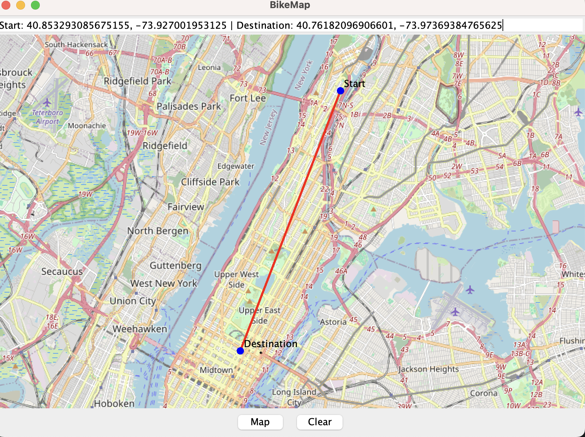

The CitiBike Final Project application allows users to interact with an 
OpenStreetMap-based interface to select two locations: their current position and their destination. 
The application sends these points to an AWS Lambda service, which determines the nearest CitiBike stations for 
renting and returning a bike. The response is displayed on the map, with markers at the stations and a route connecting
the selected points. The application uses `WaypointPainter` and `RoutePainter` to 
visualize the route and key locations effectively.
